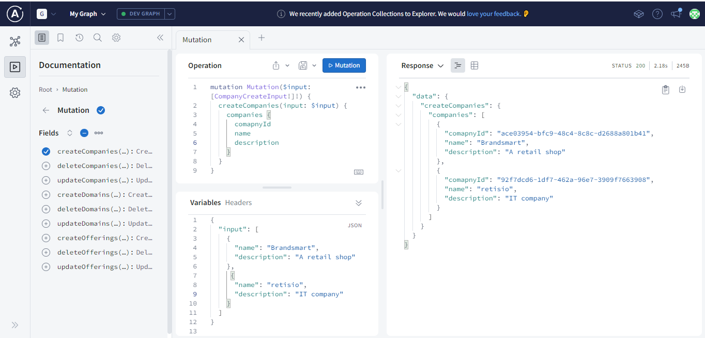
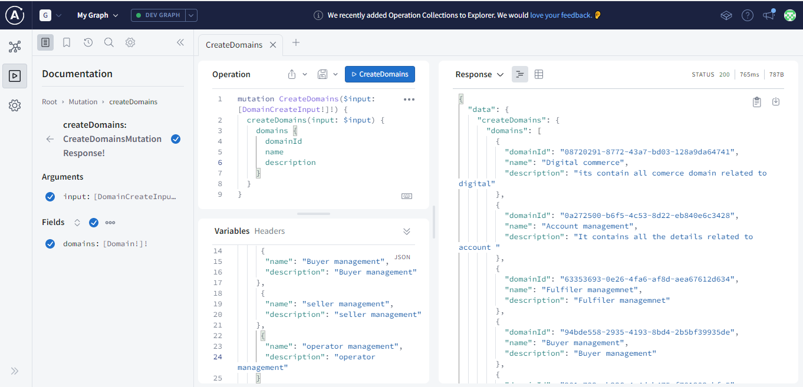
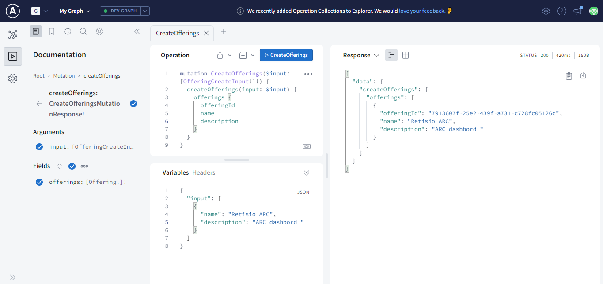

# Step to feed the data from Apollo studio

1. [Documents] (https://www.apollographql.com/docs/devtools/cli/)

2. [Try studio] (https://studio.apollographql.com/)

3. Using Apollo studio, feed the initial data with auto created mutation. Both query and mutation is avallable in the left side window. also set the connection with other entity.

   

4. Before feeding data, Don't frought to start Neo4j Desktop.
   Feed the Company data

   

5. similarly you can feed the data for domain and offering

   

   

6. creating graph connection between the entity

   

7. Doamin connection updating

   

8. End result

   
